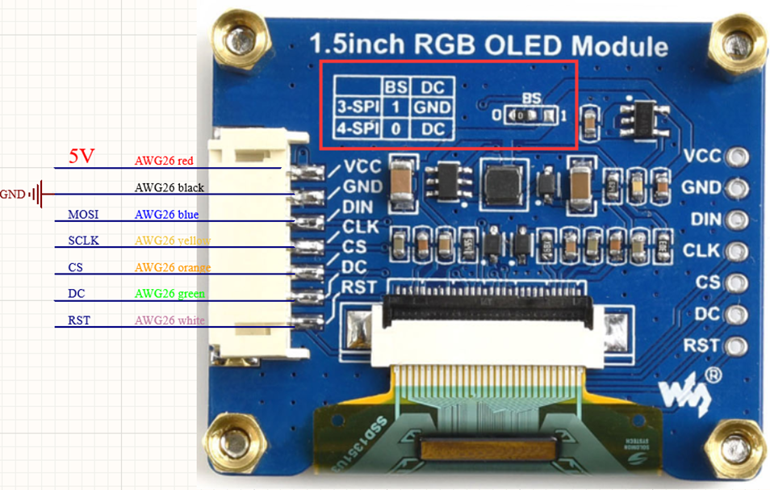
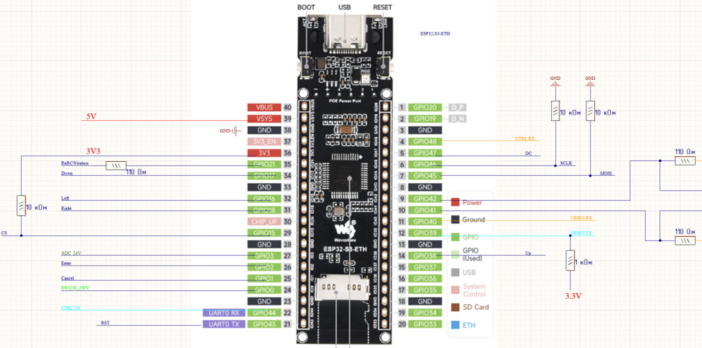
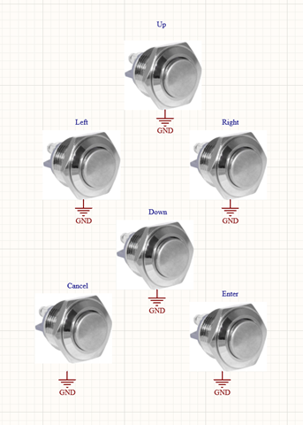

# Test Task Summary

## Target Environment

The project shall be created using the following development environment:

- **IDE:** Visual Studio Code
- **Build system:** PlatformIO
- **Framework:** Arduino
- **Target board:** ESP32-S3-ETH

---

## Hardware

### Display

Target display module: **1.5-inch RGB OLED module**.



### ESP32 Board

Target controller board: **ESP32-S3-ETH**.



### External Buttons

Four external buttons are used for user input:

- Up
- Down
- Left
- Right



---

## Functional Requirements

### 1. Project Setup

Create a PlatformIO project using:

- ESP32-S3-ETH
- Arduino framework

---

### 2. Splash Screen

At startup, the firmware shall:

1. Initialize the display.
2. Load a splash image from a file.
3. Store the splash image in the ESP32 file system in the target implementation.
4. Display the splash screen for **10 seconds**.
5. Switch to the main parameter screen after the splash screen timeout.


---

### 3. Main Parameter List

After the splash screen, the application shall display a scrollable list of **10 parameters**:

- Parameter 1
- Parameter 2
- Parameter 3
- Parameter 4
- Parameter 5
- Parameter 6
- Parameter 7
- Parameter 8
- Parameter 9
- Parameter 10

Initial parameter text color: **green**.

The following behavior is required:

- Only **4 parameters** shall be visible on the display at the same time.
- Font size and row spacing shall be selected so that the four visible items are distributed evenly over the display height.
- The **Up** and **Down** buttons shall move the current selection through the parameter list.
- The list shall scroll when the selection moves outside the currently visible four-item window.
- The upper and lower list boundaries shall be handled correctly.
- The currently selected parameter shall be tracked explicitly.
- The currently selected parameter shall be highlighted with a **yellow rectangle**.

---

### 4. Parameter Color Control

The text color of the currently selected parameter shall be changed using the horizontal buttons:

- **Right** button -> set the current parameter color to **red**
- **Left** button -> set the current parameter color to **green**

The selected colors of all parameters shall be preserved after device reboot.

---

### 5. USB Log Output

The USB log output shall mirror the display state as closely as possible.

The log shall:

- show the same four currently visible parameters;
- show which parameter is currently selected;
- indicate the color assigned to every visible parameter;
- preferably redraw or overwrite existing terminal lines instead of continuously appending duplicate output.

A possible terminal representation is:

```text
> Parameter 1 [GREEN]
  Parameter 2 [RED]
  Parameter 3 [GREEN]
  Parameter 4 [GREEN]
```

Where:

- `>` marks the currently selected parameter;
- `[GREEN]` and `[RED]` represent the parameter text color on the display.

The exact text representation of selection and color may be chosen as part of the implementation.

---

## AI Usage

AI tools may and should be used during implementation.

All relevant prompts used during development shall be provided with the final submission.

Recommended project documentation file:

```text
docs/AI_PROMPTS.md
```

---

## Deliverables

The final result shall include:

- PlatformIO project folder;
- source code;
- project configuration;
- splash image file;
- AI prompts used during development;
- supporting documentation.

---

## Suggested Repository Structure

```text
esp32_display_test/
|
|-- data/
|   `-- splash.bmp
|
|-- docs/
|   |-- task_summary.md
|   |-- AI_PROMPTS.md
|   `-- images/
|       |-- display_module.png
|       |-- esp32_s3_eth_pinout.png
|       |-- buttons_layout.png
|       `-- splash_reference.png
|
|-- include/
|   |-- app_state.h
|   |-- config.h
|   |-- display_view.h
|   |-- input_buttons.h
|   |-- serial_view.h
|   `-- storage.h
|
|-- src/
|   |-- display_view.cpp
|   |-- input_buttons.cpp
|   |-- main.cpp
|   |-- serial_view.cpp
|   `-- storage.cpp
|
|-- .gitignore
|-- platformio.ini
`-- README.md
```

---

## Notes

- Hardware-specific behavior shall be verified on the actual ESP32-S3-ETH board when the hardware becomes available.
- Display initialization and rendering depend on the exact display controller and interface used by the provided OLED module.
- The application logic should remain separated from hardware-specific code where practical, so that menu behavior can be tested independently from the physical display and buttons.
